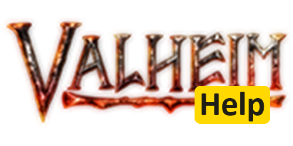

# Valheim Help



Valheim Help is a community project to enable trophy tracking and leaderboards for trophy hunt speed run competitions.

We provide a backend to the popular [Trophy Hunt Mod](https://thunderstore.io/c/valheim/p/oathorse/TrophyHuntMod/) for Valheim by oathorse.

## Prerequisites
Install dotnet for backend API
Install node for frontend react

## Build
Instructions to build the project:

```sh
# Clone the repository
git clone https://github.com/jarrettv/ValHelp.git

# Navigate to the backend directory
cd ValHelp/api

# Build backend
dotnet build

# Navigate to frontend directory
cd ../web

# Build frontend
npm i && npm run build
```

## Run
Instructions to run the project:

```sh
dotnet run
npm run dev
```

## Contributing
Contact JV on [Valheim Speedrunning Discord](https://discord.gg/ZDJ5gnB5)

## Sponsor
Useful? Consider [sponsoring me on GitHub](https://github.com/sponsors/jarrettv)